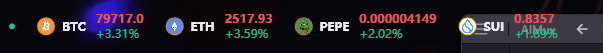
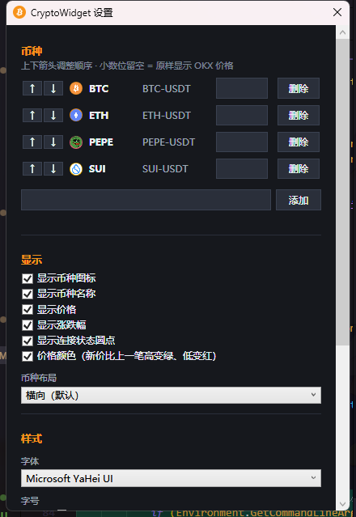

<p align="center">
  
</p>

<h1 align="center">CryptoWidget</h1>

<p align="center">
  <b>一个轻量、常驻桌面的加密货币实时行情悬浮卡片</b><br/>
  基于 OKX 公共 WebSocket 行情，无边框半透明卡片常驻桌面，
  支持多币种订阅、钉住置顶、托盘常驻、样式自定义与开机自启。
</p>

<p align="center">
  
  
  
  
</p>

---

## 📑 目录

- [✨ 项目简介](#-项目简介)
- [🚀 核心功能](#-核心功能)
- [🖼️ 截图](#️-截图)
- [📦 安装与运行](#-安装与运行)
- [🔧 从源码构建](#-从源码构建)
- [⚙️ 配置说明](#️-配置说明)
- [🧩 技术栈](#-技术栈)
- [🤝 贡献](#-贡献)
- [📄 许可证](#-许可证)

---

## ✨ 项目简介

**CryptoWidget** 是一个基于 WPF（.NET 9）打造的桌面端加密货币行情悬浮组件。它的目标是：

- **一眼看到行情**：OKX 公共行情实时推送，无边框半透明卡片常驻桌面任意角落，不遮挡工作。
- **零配置上手**：默认订阅 BTC-USDT，输入币种代码自动补全交易对，即开即用。
- **安静不打扰**：卡片半透明淡出、价格跳动高亮、断线自动重连，全程无需人工干预。

> 本项目为个人开源项目，欢迎 Issue 与 PR。当前版本为 `v0.0.1`。

---

## 🚀 核心功能

| 功能 | 说明 |
| --- | --- |
| 📈 **实时行情** | OKX 公共 WebSocket（tickers 频道）推送最新价与 24h 涨跌幅，主/备节点自动切换 |
| 🪟 **悬浮卡片** | 无边框圆角半透明卡片，可拖动，窗口位置记忆；背景透明度 0%~90% 可调 |
| 📌 **托盘常驻** | 关闭卡片即隐藏到系统托盘，**左键单击呼出**；右键菜单：置顶 / 设置 / Quit |
| 📊 **多币种管理** | 增删任意币种（自动拼接 `-USDT`），**上下箭头调整顺序**，每币种可单独配置小数位 |
| 🎨 **价格跳动着色** | 新价比上一笔高变绿、低变红（大屏效果），可配置开关 |
| ↔️ **横 / 竖布局** | 一键切换币种横向 / 竖向排列，竖向时币种名固定宽度对齐 |
| 🖥️ **样式自定义** | 字体（下拉）、字号（联动币种图标缩放）、字重（常规/半粗/粗体） |
| 🔁 **断线自动重连** | 指数退避静默重连（2s→4s→8s→16s→30s 封顶），机场/代理短暂抖动自动恢复 |
| 🧊 **单实例 + 开机自启** | 二次启动自动唤起已运行的卡片；开机自启（注册表）可配置 |

---

## 🖼️ 截图

> 📌 图片位于 `docs/screenshots/`。

### 1. 桌面悬浮卡片（横向布局）



### 2. 设置窗口



---

## 📦 安装与运行

### 方式一：下载安装包（推荐）

1. 前往 [Releases](../../releases) 页面下载最新的 `CryptoWidget-Setup-x.y.z.exe` 安装包（自包含单文件，**无需安装 .NET 运行时**）。
2. 双击安装，完成后即可从桌面快捷方式启动。
3. 首次启动默认订阅 BTC-USDT，可在托盘右键「设置」中添加币种与调整外观。

### 方式二：从源码运行（开发者）

见下方 [🔧 从源码构建](#-从源码构建)。

---

## 🔧 从源码构建

### 环境要求

- **Windows 10 / 11**
- **.NET 9 SDK**（<https://dotnet.microsoft.com/download>）
- Visual Studio 2022（含「桌面开发」工作负载）或 Rider

### 构建步骤

```bash
# 1. 克隆仓库
git clone https://github.com/Ledgerbiggg/CryptoWidget.git
cd CryptoWidget

# 2. 还原依赖并构建
dotnet restore
dotnet build CryptoWidget.sln -c Release

# 3. 运行
dotnet run --project CryptoWidget.Shell/CryptoWidget.Shell.csproj -c Release
```

### 开发快捷命令（Makefile）

| 命令 | 说明 |
| --- | --- |
| `make dev` | 一键启动：杀残留进程 + 构建 + 运行 |
| `make watch` | **热部署**：监听源码变化自动重建并重启（按 `Q` 或创建 `.watch-quit` 退出） |
| `make build` / `make run` | 仅构建 / 仅运行 |
| `make dist` | 本地打包安装包（需 Inno Setup），产出 `package/CryptoWidget-Setup-x.y.z.exe` |
| `make release NOTES="..."` | 发版：升版本号 + 写更新清单 + 提交推送（GitHub Actions 自动出包） |

---

## ⚙️ 配置说明

所有配置保存在 `%AppData%\CryptoWidget\settings.json`（JSON 格式，程序内修改即保存）：

- **币种**：列表（交易对 + 每币种小数位，留空 = 原样显示 OKX 价格）、展示顺序。
- **显示开关**：币种图标 / 名称 / 价格 / 涨跌幅 / 连接状态圆点。
- **外观**：背景透明度、字体、字号、字重、横向/竖向布局、价格跳动着色。
- **行为**：置顶、开机自启、窗口位置记忆。
- **网络**：代理地址（默认 `http://127.0.0.1:7890`，留空走系统代理/环境变量）。

> 💡 行情数据来自 OKX 公共接口，本应用不涉及任何密钥与交易操作。

---

## 🧩 技术栈

- **语言 / 框架**：C# / .NET 9、WPF
- **架构**：Prism + Unity（MVVM、依赖注入）
- **行情**：[Websocket.Client](https://www.nuget.org/packages/WebSocket.Client)（OKX 公共 WS）
- **托盘**：`System.Windows.Forms.NotifyIcon`
- **打包 / 发布**：Inno Setup + GitHub Actions（自动构建安装包与 Release）

---

## 🤝 贡献

欢迎一切形式的贡献！

1. Fork 本仓库并创建你的特性分支 (`git checkout -b feature/xxx`)
2. 提交你的修改 (`git commit -m 'feat: 添加 xxx'`)
3. 推送到分支 (`git push origin feature/xxx`)
4. 打开一个 Pull Request

提交前请运行 `dotnet build` 确保无错误，并遵循现有的代码风格。

---

## 📄 许可证

本项目基于 **MIT License** 开源。详见 [LICENSE](LICENSE) 文件。

---

<p align="center">
  Made with ❤️ by CryptoWidget contributors
</p>
